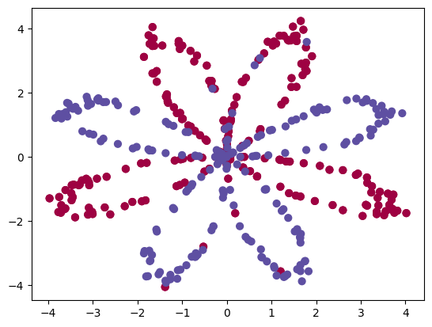
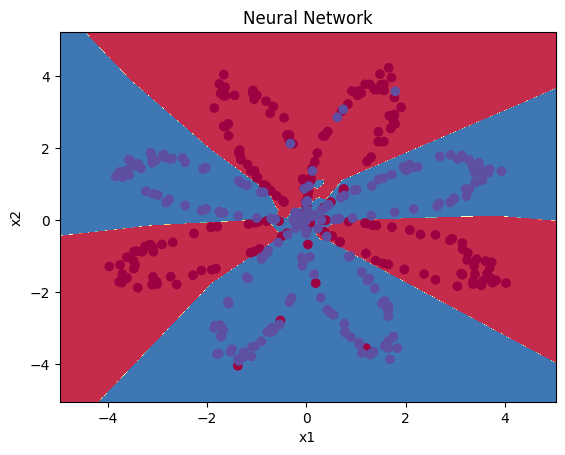
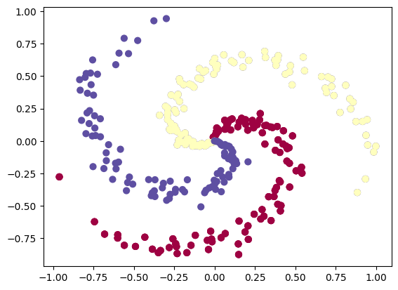
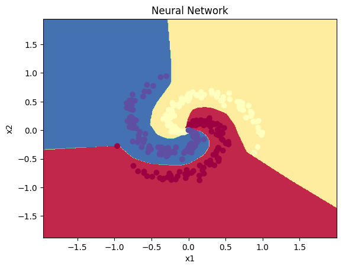

# Nonlinear Decision Boundaries with a Two-Layer Neural Network

Implementation of a **regularized 2-layer multiclass classifier** on nonlinear 2D benchmarks (**flower**, **spiral**) in **NumPy** (explicit backprop) and **PyTorch** (module-based baseline).

---

### Model class

A single-hidden-layer network:

```math
z_2 = W_1 x + b_1
\\
a_2 = \phi(z_2)
\\
z_3 = W_2 a_2 + b_2
\\
p = \mathrm{softmax}(z_3)
```

with activation $\phi \in \{\mathrm{ReLU}, \sigma\}$. This is the simplest nonlinear hypothesis class that can represent **nonlinearly separable decision boundaries** (e.g., spiral), illustrating feature learning via learned hidden representations.

### Objective

**Empirical risk minimization** with **L2 regularization** (weight decay):

```math
\mathcal{L}
=
\frac{1}{n}\sum_{i=1}^{n} \mathrm{CE}(y_i, p_i)
+
\frac{\lambda}{2}\left(\lVert W_1\rVert_F^2 + \lVert W_2\rVert_F^2\right).
```

Cross-entropy corresponds to the **negative log-likelihood** under a categorical model $p(y\mid x)$.

### Optimization

Full-batch **gradient descent / SGD** using analytically derived gradients; demonstrates the chain rule through **softmax + cross-entropy** (yielding $p-y$) and through the hidden nonlinearity.

### Numerical stability

Softmax is computed with log-sum-exp shifting to prevent overflow.

### Verification

**Finite-difference gradient checking** (using sigmoid to ensure differentiability everywhere) validates the NumPy backprop by comparing:

```math
\frac{\lVert g_{\text{num}} - g_{\text{ana}}\rVert}{\lVert g_{\text{num}} + g_{\text{ana}}\rVert}
```

against a small tolerance.

---

## Quickstart

### 1) Install

```bash
python -m venv .venv
source .venv/bin/activate

pip install -r requirements.txt
```

### 2) Run training

NumPy (Flower):
```bash
python scripts/train_flower_numpy.py
```

NumPy (Spiral):
```bash
python scripts/train_spiral_numpy.py
```

PyTorch (Flower):
```bash
python scripts/train_flower_torch.py
```

PyTorch (Spiral):
```bash
python scripts/train_spiral_torch.py
```

Plots are saved to:

- `outputs/figures/flower-boundary.jpg`
- `outputs/figures/spiral-boundary.jpg`

---

## Results

### Flower dataset



### Flower decision boundary



### Spiral dataset



### Spiral decision boundary



---

## Gradient checking

Gradient checking uses a **sigmoid** hidden activation so the network is differentiable everywhere (ReLU is not differentiable at 0, which makes numerical gradients disagree near 0).

Run:

```bash
python scripts/gradient_check.py
```

The printed output includes the relative difference:

```math
\frac{\lVert g_{\text{num}} - g_{\text{ana}}\rVert}{\lVert g_{\text{num}} + g_{\text{ana}}\rVert}
```

A typical pass condition is `diff < 1e-6`.


